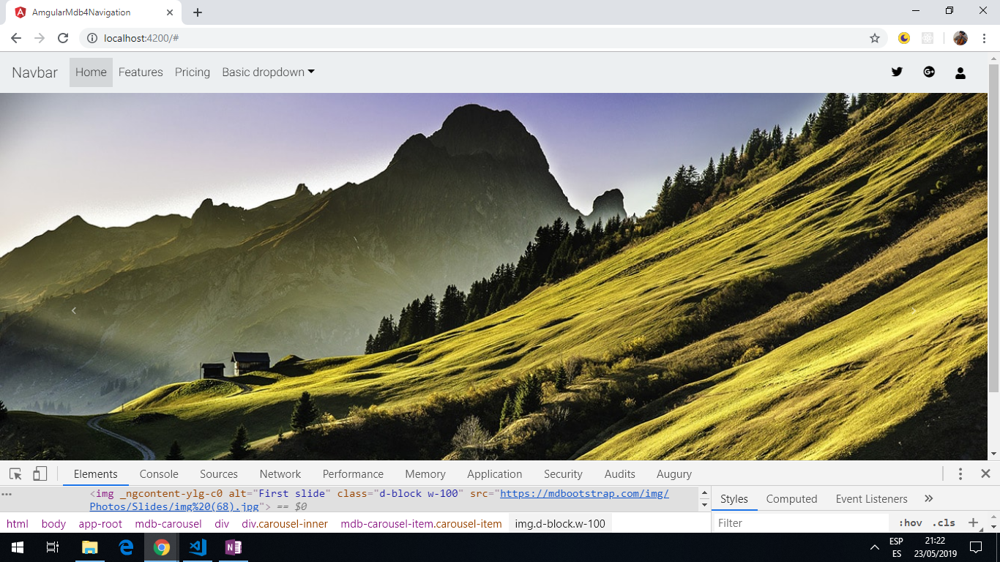

# Angular MDB4 Navigation

App to use [Material Bootstrap 4](https://mdbootstrap.com/docs/angular/) library elements, including [nav bars](https://mdbootstrap.com/docs/angular/navigation/navbar/).

*** Note: to open web links in a new window use: _ctrl+click on link_**

## Table of contents

* [General info](#general-info)
* [Screenshots](#screenshots)
* [Technologies](#technologies)
* [Setup](#setup)
* [Features](#features)
* [Status](#status)
* [Inspiration](#inspiration)
* [Contact](#contact)

## General info

* Bootstrap menus.

## Screenshots



## Technologies

* [Angular CLI v7.3.9](https://github.com/angular/angular-cli)

* [Angular framework v7.2.0](https://angular.io/)

* [ng-canvas-gauges v6.0.4](https://www.npmjs.com/package/ng-canvas-gauges)

* [chart.js@2.8.0](https://www.npmjs.com/package/chart.js?activeTab=readme)

* [font-awesome@4.7.0](https://www.npmjs.com/package/font-awesome)

* [angular-bootstrap-md@7.5.2](https://www.npmjs.com/package/angular-bootstrap-md)

* [hammerjs@2.0.8](https://www.npmjs.com/package/hammerjs)

## Setup

Run `ng serve` for a dev server. Navigate to `http://localhost:4200/`. The app will automatically reload if you change any of the source files.

## Code Examples

* bootstrap code showing dropdown menu.

```html
      <!-- Dropdown -->
      <li class="nav-item dropdown" dropdown>
        <a dropdownToggle mdbWavesEffect type="button" class="nav-link dropdown-toggle waves-light" mdbWavesEffect>
          Basic dropdown<span class="caret"></span></a>
        <div *dropdownMenu class="dropdown-menu dropdown dropdown-primary" role="menu">
          <a class="dropdown-item waves-light" mdbWavesEffect href="#">Action</a>
          <a class="dropdown-item waves-light" mdbWavesEffect href="#">Another action</a>
          <a class="dropdown-item waves-light" mdbWavesEffect href="#">Something else here</a>
          <div class="divider dropdown-divider"></div>
          <a class="dropdown-item waves-light" mdbWavesEffect href="#">Separated link</a>
        </div>
      </li>
```

## Features

* Colour schemes can be changed.

## Status & To-Do List

* Status: Bootstrap code that displays photos using a carousel and a top menu navbar.

* To-Do: Add footer and try different colours and settings then transfer to angular-website. 

## Inspiration

* [Coursetro: MdBootstrap Tutorial - Integrating Material Design, Bootstrap 4 & Angular 5](https://www.youtube.com/watch?v=m68xvSiuijE)

## Contact

Repo created by [ABateman](https://www.andrewbateman.org) - feel free to contact me!
