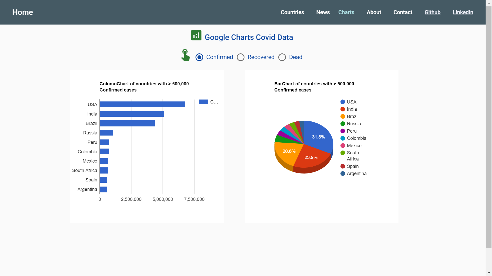

# :zap: Angular Data Charts

* This is a responsive Angular app that displays Covid API data & news for the user country and worldwide. Data is displayed using google-charts and Angular Material tables/display components.
* **Note:** to open web links in a new window use: _ctrl+click on link_


## :page_facing_up: Table of contents

* [:zap: Angular Data Charts](#zap-angular-data-charts)
  * [:page_facing_up: Table of contents](#page_facing_up-table-of-contents)
  * [:books: General info](#books-general-info)
  * [:camera: Screenshots](#camera-screenshots)
  * [:signal_strength: Technologies](#signal_strength-technologies)
  * [:floppy_disk: Setup](#floppy_disk-setup)
  * [:flashlight: Testing](#flashlight-testing)
  * [:computer: Code Examples](#computer-code-examples)
  * [:cool: Features](#cool-features)
  * [:clipboard: Status & To-Do List](#clipboard-status--to-do-list)
  * [:clap: Inspiration](#clap-inspiration)
  * [:file_folder: License](#file_folder-license)
  * [:envelope: Contact](#envelope-contact)

## :books: General info

* **General:** Chart data from [Corona API](https://api.coronatracker.com/) JSON time-series of coronavirus cases (confirmed, deaths and recovered) per country. Detects user location and shows data from that country.
* **Home Page:** World and local Covid data - using [iPapa API](https://ipapi.co/) to detect user country. Data shown in tables on Mat-cards and on Google charts using tab-groups to select between confirmed cases, deaths and recovered.
* **Countries Page:** Covid data is fetched from local storage and displayed using a Mat-Table of countries. Flags are obtained from the Countryflags API.
* **News & NewsDetail Pages:** Covid news data is shown on Mat-cards. The Day.js npm module is used to convert the UTC format date into '... ago'. Clicking on a news card will route the user to a news detail page with the JSON data passed using angular router navigation extras. The Coronatracker API does not have a lot of the latest news but it demonstrates a working app. **add country select menu.**
* **Charts Page** Pie and column charts using `angular-google-charts`.**add another chart**
* **About Page:** Mat-cards show details of each page with useful links.
* **Contact Page:** Mat-card with Github and contact details from the Github API (no API access key required for this).

## :camera: Screenshots





## :signal_strength: Technologies

* [Angular v12](https://angular.io/)
* [Angular Material v12](https://material.angular.io/)
* [Angular Material Icons](https://material.io/resources/icons/?style=baseline)
* [Angular Material theming](https://material.angular.io/guide/theming)
* [material design colors](https://www.materialpalette.com/colors) palette
* [Angular Google Charts](https://www.npmjs.com/package/angular-google-charts) wrapper for the Google Charts library
* [Dayjs v1](https://github.com/iamkun/dayjs) to convert Github UTC Timestamp to '... ago'
* [RxJS Library v6](https://angular.io/guide/rx-library) used to handle datastreams and propagation of change using observables
* [Angular Augury Chrome Extension](https://chrome.google.com/webstore/detail/augury/elgalmkoelokbchhkhacckoklkejnhcd) v1 used for debugging
* [rxaviers: Complete list of github markdown emoji markup](https://gist.github.com/rxaviers/7360908)
* [Quicktype to extract typescript model from JSON object](https://app.quicktype.io/)
* [Coronatracker API](http://api.coronatracker.com/)
* [Country Flags API](https://www.countryflags.io)

## :floppy_disk: Setup

* Install dependencies by running `npm i`
* Run `ng test` for Jasmine tests carried out in Karma console
* Run `ng serve` for a dev server. Navigate to `http://localhost:4200/`. The app will automatically reload if you change any of the source files
* Run `ng build` to build the project. The build artifacts will be stored in the `dist/` directory. Use the `--prod` flag for a production build
* Deploy using `firebase deploy`

## :flashlight: Testing

* Run `ng test` to execute the unit tests via [Karma](https://karma-runner.github.io).
* Run `ng e2e` to execute the end-to-end tests via [Protractor](http://www.protractortest.org/).

## :computer: Code Examples

* extract from `covid-news.component.ts` to subscribe to news API data and store it in local storage

```typescript
// subscribe to news API data observable
getCovidNews(): void {
  this.covidDataService.getCovidNews().subscribe((data: NewsItems) => {
    this.storageService.set("totalNewsItems", data.total);
    this.storageService.set("storedNewsItems", data.items);
    this.newsItems = this.storageService.get("storedNewsItems");
  });
}

 // create news API observable
getCovidNews(): Observable<NewsItems> {
  this.newsArrayLength = 20;
  this.storageService.set('newsArrayLength', this.newsArrayLength);
  this.userCountry = this.storageService.get('userCountryData').name;
  return this.http
    .get<NewsItems>(
      apiNewsBaseUrl +
        `?limit=${this.newsArrayLength}&offset&country=${this.userCountry}`
    )
    .pipe(
      // tap((data: NewsItems) => console.log('news data', data)),
      map((data: NewsItems) => data),
      catchError((err) => {
        return throwError(err);
      })
    );
}
```

## :cool: Features

* Separate Material module with all Material modules accessed via Shared module - review this decision!
* Detects user location data during the Home page ng 'on initialisation' lifecycle using a simple API GET request via the `location.service.ts` file.

## :clipboard: Status & To-Do List

* Status: Working but issue with getting user country from storage before card using it is rendered.
* To-Do: Fix user country service or add drop down country select menu. Add Jasmine testing.

## :clap: Inspiration

* [Angular Material 10/9 Tutorial: Build Navigation UI with Toolbar and Side Navigation Menu](https://www.techiediaries.com/angular-material-navigation-toolbar-sidenav/)
* [Angular Material Theme Colors](https://medium.com/@treviergits/angular-material-theme-color-options-7d5968cb7460)
* [TutorialsPoint: Angular Google Charts Tutorial](https://www.tutorialspoint.com/angular_googlecharts/index.htm)
* [Stackoverflow, Regular Expression for formatting numbers in JavaScript](https://stackoverflow.com/questions/2254185/regular-expression-for-formatting-numbers-in-javascript) to convert chart threshold numbers to strings with comma separation
* [Santosh Yadav, Stop Using Shared Material Module](https://indepth.dev/stop-using-shared-material-module/)
* [#ANGULAR, Deploying an Angular App to Firebase Hosting](https://alligator.io/angular/deploying-angular-app-to-firebase/)

## :file_folder: License

* This project is licensed under the terms of the MIT license.

## :envelope: Contact

* Repo created by [ABateman](https://github.com/AndrewJBateman), email: gomezbateman@yahoo.com
