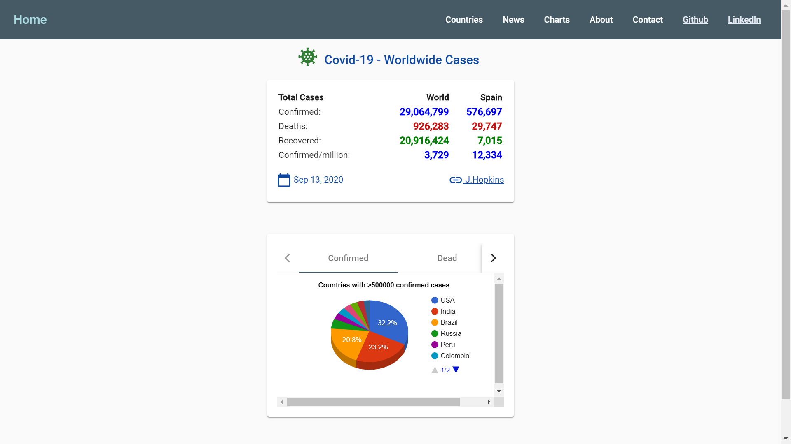
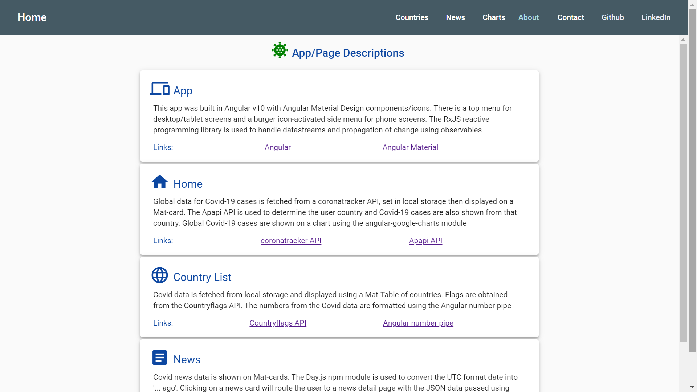

# Angular MD-Bootstrap Navigation

App to use [Angular Material Bootstrap 4](https://mdbootstrap.com/docs/angular/) library elements, including [nav bars](https://mdbootstrap.com/docs/angular/navigation/navbar/), [feature section](https://mdbootstrap.com/docs/angular/sections/features/), [project section](https://mdbootstrap.com/docs/angular/sections/projects/) and [blog section](https://mdbootstrap.com/docs/angular/sections/blog/).

*** Note: to open web links in a new window use: _ctrl+click on link_**

## Table of contents

* [General info](#general-info)
* [Screenshots](#screenshots)
* [Technologies](#technologies)
* [Setup](#setup)
* [Features](#features)
* [Status](#status)
* [Inspiration](#inspiration)
* [Contact](#contact)

## General info

* Bootstrap html code pasted in and modified. Includes routing module and working nav bar.

## Screenshots




## Technologies

* [Angular framework v9.1.0(https://angular.io/)

* [chart.js@2.8.0](https://www.npmjs.com/package/chart.js?activeTab=readme)

* [font-awesome@4.7.0](https://www.npmjs.com/package/font-awesome)

* [angular-bootstrap-md@8.10.0](https://www.npmjs.com/package/angular-bootstrap-md)

* [hammerjs@2.0.8](https://www.npmjs.com/package/hammerjs)

## Setup

Install dependencies then run `ng serve` for a dev server. Navigate to `http://localhost:4200/`. The app will automatically reload if you change any of the source files.

## Code Examples

* bootstrap code showing dropdown menu.

```html
      <!-- Dropdown -->
      <li class="nav-item dropdown" dropdown>
        <a dropdownToggle mdbWavesEffect type="button" class="nav-link dropdown-toggle waves-light" mdbWavesEffect>
          Basic dropdown<span class="caret"></span></a>
        <div *dropdownMenu class="dropdown-menu dropdown dropdown-primary" role="menu">
          <a class="dropdown-item waves-light" mdbWavesEffect href="#">Action</a>
          <a class="dropdown-item waves-light" mdbWavesEffect href="#">Another action</a>
          <a class="dropdown-item waves-light" mdbWavesEffect href="#">Something else here</a>
          <div class="divider dropdown-divider"></div>
          <a class="dropdown-item waves-light" mdbWavesEffect href="#">Separated link</a>
        </div>
      </li>
```

## Features

* lots of bootstrap examples can be simply pasted in. Colour schemes, padding etc can be changed etc in scss.

## Status & To-Do List

* Status: NOT Working after Angular 9 upgrade. Angular app with Material Bootstrap installed. No dependency conflicts. Error on compiling:
`
ERROR in multi ./src/styles.scss ./node_modules/@fortawesome/fontawesome-free/scss/fontawesome.scss ./node_modules/@fortawesome/fontawesome-free/scss/solid.scss ./node_modules/@fortawesome/fontawesome-free/scss/regular.scss ./node_modules/@fortawesome/fontawesome-free/scss/brands.scss ./node_modules/angular-bootstrap-md/scss/bootstrap/bootstrap.scss ./node_modules/angular-bootstrap-md/scss/mdb-free.scss
Module not found: Error: Can't resolve 'C:\Users\gomez\code\angular-mdb4-navigation\node_modules\angular-bootstrap-md\scss\bootstrap\bootstrap.scss' in 'C:\Users\gomez\code\angular-mdb4-navigation'`

* To-Do: Fix error. Add footer and try different colours and settings then transfer some parts such as navbar and projects to angular-website.

## Inspiration

* [Coursetro: MdBootstrap Tutorial - Integrating Material Design, Bootstrap 4 & Angular 5](https://www.youtube.com/watch?v=m68xvSiuijE)

* [Material Design for Bootstrap Angular - 5 min Quick Start](https://www.youtube.com/watch?v=J3M0QS6YB0w)

## Contact

Repo created by [ABateman](https://www.andrewbateman.org) - feel free to contact me!
